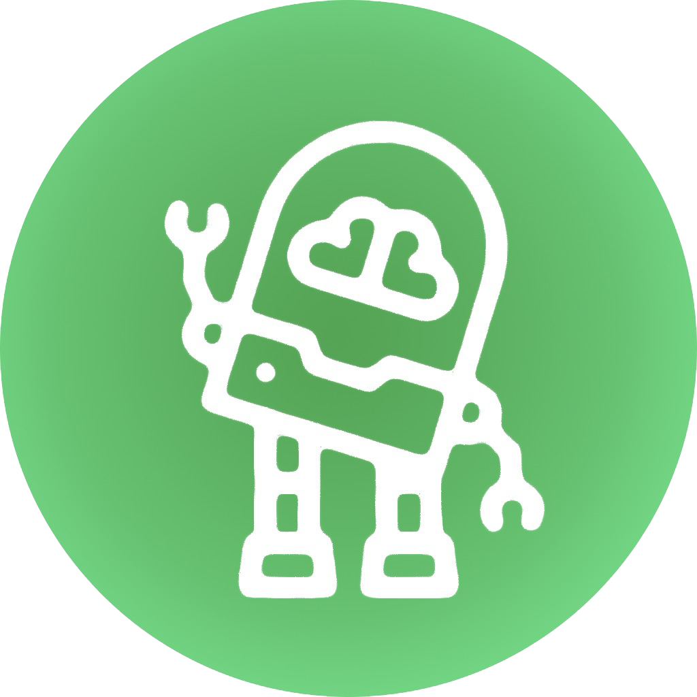
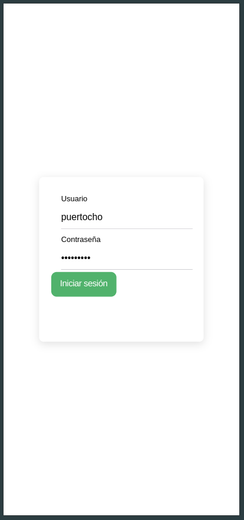
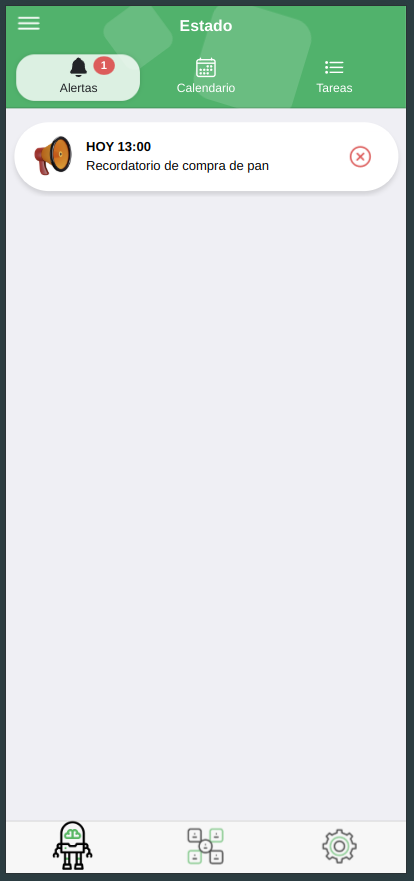
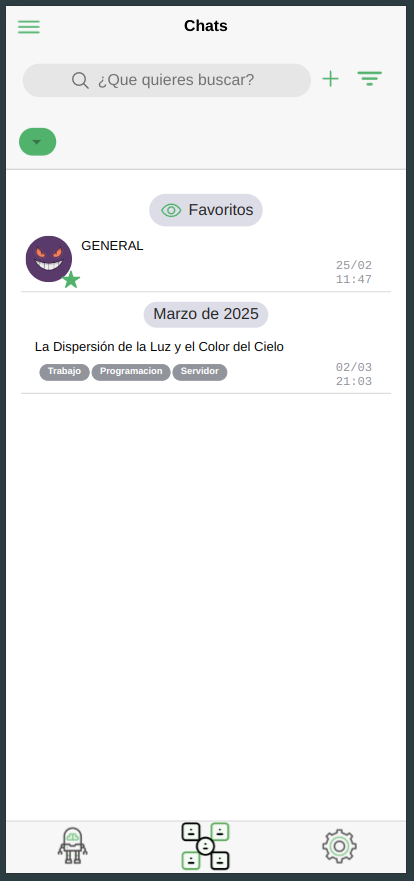
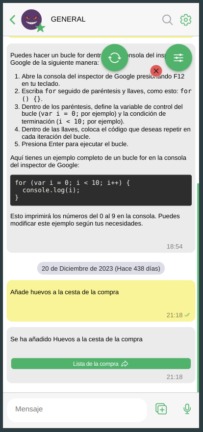
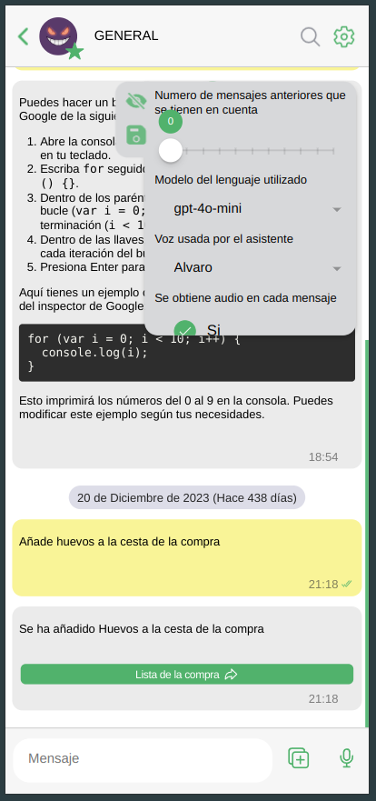
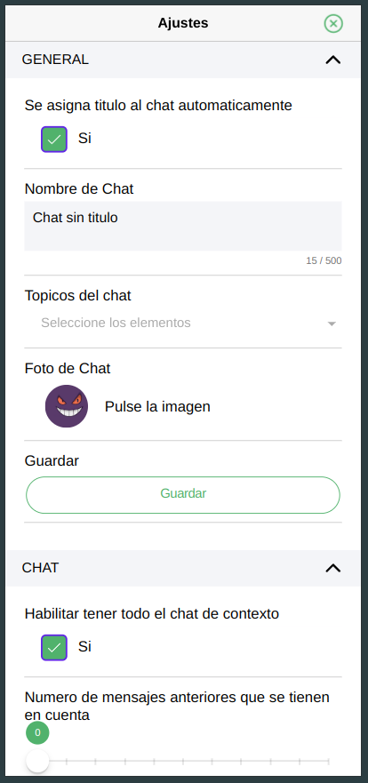
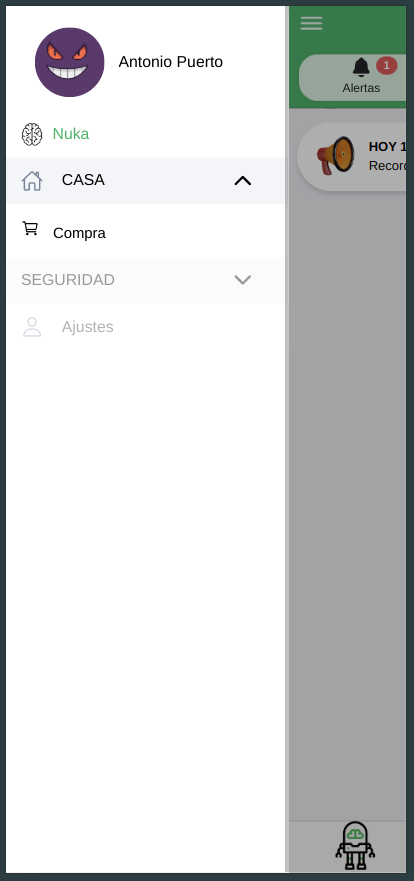
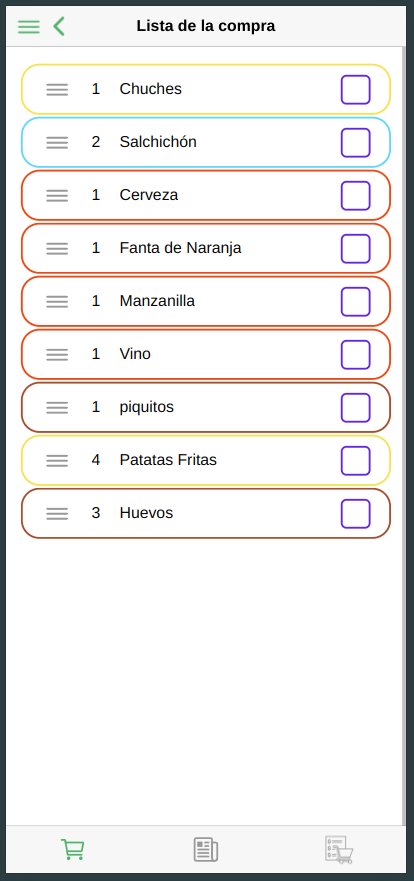
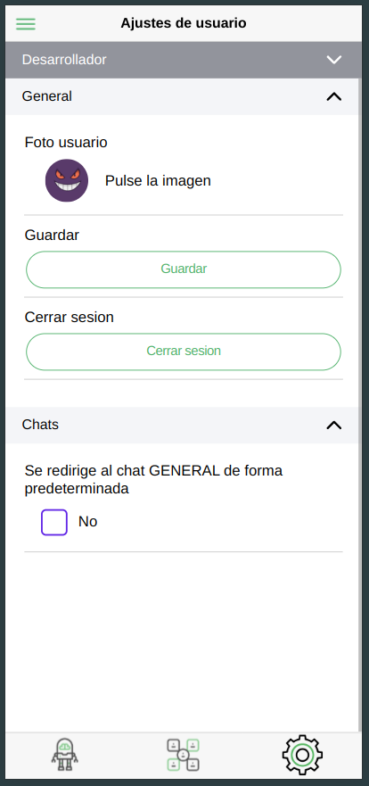

# IA Generativa – Nuka



Nuka es un asistente personal que he estado desarrollando durante los últimos dos años, coincidiendo prácticamente con la llegada de ChatGPT. Este proyecto surge de mi interés por la IA, la automatización y la integración de modelos en infraestructuras locales.

Se compone de dos partes principales:

nuka_app → Aplicación móvil desarrollada con Ionic 6 + Capacitor y Angular 18 para interactuar con el asistente.

nuka_server → Backend en Spring Boot 2.7 (Java 17) que procesa peticiones, gestiona usuarios y administra los diferentes módulos del asistente.
El sistema sigue una arquitectura basada en microservicios y está dockerizado para facilitar el despliegue, escalabilidad y mantenimiento. Este mismo Backend tiene la posibilidad de hacer peticiones a otros endpoint con FastApi con Python.

# Arquitectura y Tecnologías

## Backend (nuka_server)

- Java 17 con Spring Boot 2.7.
- APIs REST y WebSockets para comunicación en tiempo real.
- Integración con bases de datos relacionales (MySQL) y NoSQL (MongoDB).
- Gestión de eventos con Kafka para ciertas automatizaciones.
- Despliegue con Docker y Docker Compose.
- Seguridad mediante OAuth2 + JWT.

## Frontend (nuka_app)

- Aplicación móvil con Ionic 6 + Capacitor y Angular 18.
- Soporte para PWA y aplicaciones nativas (Android/iOS).
- Almacenamiento local con SQLite y IndexedDB.
- Notificaciones en tiempo real con Firebase Cloud Messaging (FCM).
- UI adaptable con Material Design.

## Infraestructura y despliegue

- Soporte para modelos de IA en local y en la nube.
- Integración con OpenAI API y modelos de código abierto ejecutándose en CUDA sobre LLMs locales.
- Administración de servicios mediante Cloudflare para control remoto.
- Soporte para infraestructura de nube privada con sincronización en tiempo real.
- Logs y monitoreo.

## Funcionalidades
Hasta ahora, como prueba de concepto, Nuka cuenta con las siguientes características:

- Chat inteligente → Al estilo de ChatGPT/OpenWebUI, con soporte para modelos locales y en la nube.
- Gestión de alertas, calendario y tareas → Organización y planificación integrada con sincronización en tiempo real.
- Gestión de compras → Sección para administrar el carrito de la compra, con lista inteligente.
- Soporte para múltiples modelos de IA → Alternancia entre la API de OpenAI y modelos locales en mi infraestructura con CUDA.
- Automatización de recordatorios → Creación automática mediante el chat.
- Asistente de voz → Integración con STT (Speech-to-Text) y TTS (Text-to-Speech), explorando modelos como F5 TTS.

Este asistente no solo es un experimento técnico, sino también una demostración de cómo integrar microservicios, IA, automatización y analítica de datos en una única solución escalable.

# Galeria de imagenes











# Video 

Disponible en -> imagenes/video_0.mp4

# Ejecutalo tu mismo!

El proyecto esta Dockerizado como se ha comentado antes, solo tienes que ejecutar dentro de la carpeta **nuka_app** para levantar la aplicación

```bash
sudo ./construirApp.sh
```

y dentro de **nuka_server** para levantar el servidor

```bash
sudo ./construirNuka.sh
```
